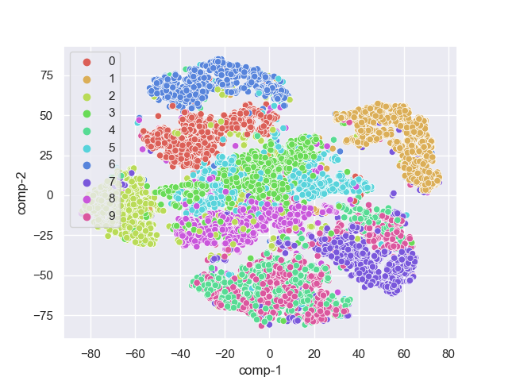
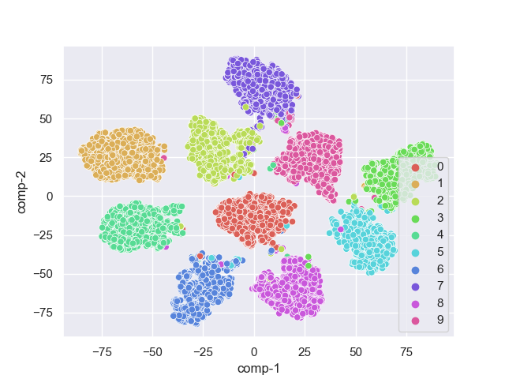

# contrastive_learning
Learning about the basics of contrastive representation learning following [Lilian Weng's blog post](https://lilianweng.github.io/posts/2021-05-31-contrastive/)

## Unsupervised Learning

For this I experiment with encoding the MNIST dataset into a latent of size 10 using an autoencoder. Some notation: $x$ is the input, $z$ is the latent, $f^e_\theta$ is the encoder, $f^d_\theta$ is the decoder, and $\theta$ is the set of parameters for the encoder and decoder. The autoencoder consist of several Conv2D, MaxPool and Linear layers, all with ELU activation functions. The decoder is aiming to match the encder in architecture.

1. **MSE Loss:** Using a normal autoencoder with a standard MSE loss, I get a latent space all over the place

$$ \mathcal{L}_{MSE}(x, \theta) = || f_\theta^d(f^e_\theta(x)) - x ||^2_2 $$

2. **Contrastive loss**

$$ \mathcal{L}_{cont}(x_i, x_j, \theta) = \mathbb{1}[y_i = y_j] ||f^e_\theta(x_i) - f^d_\theta(x_j) ||_2 + \mathbb{1}[y_i \neq y_j] \max(0, \epsilon - || f^e_\theta(x_i) - f^d_\theta(x_j) ||_2) $$

where is a hyperparameter, defining the lower bound distance between samples of different classes. Taken from [Lilian Weng's blog post](https://lilianweng.github.io/posts/2021-05-31-contrastive/).

